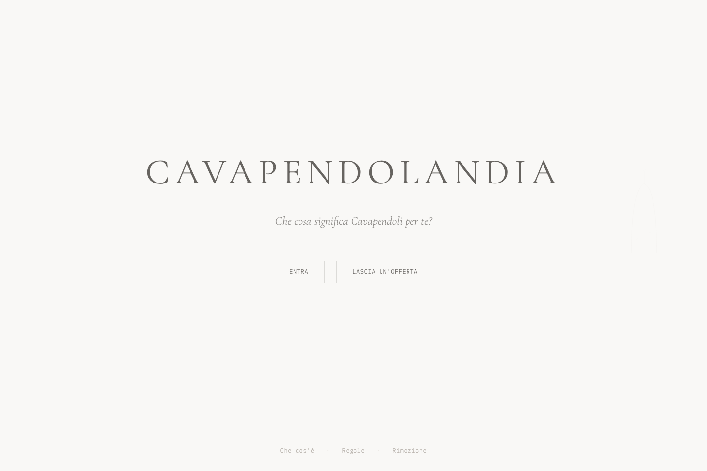
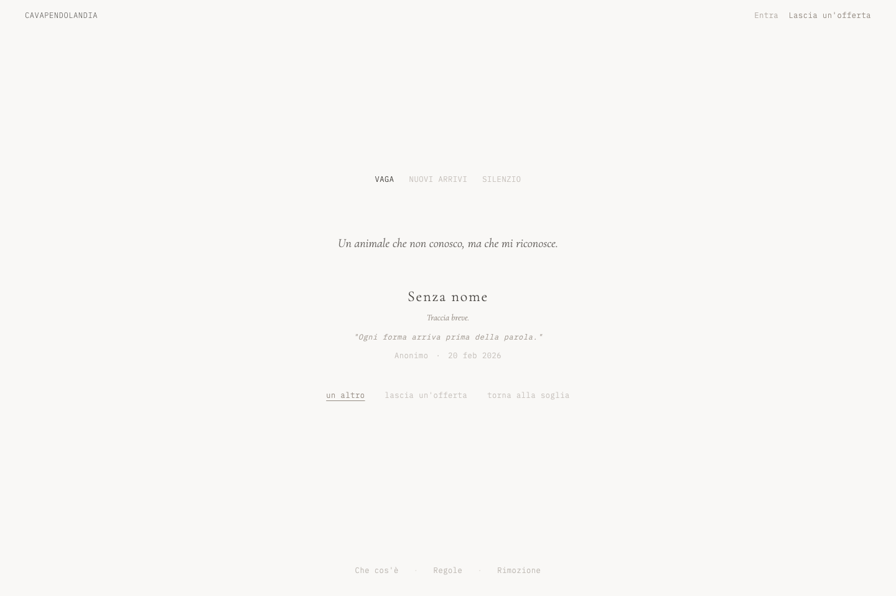
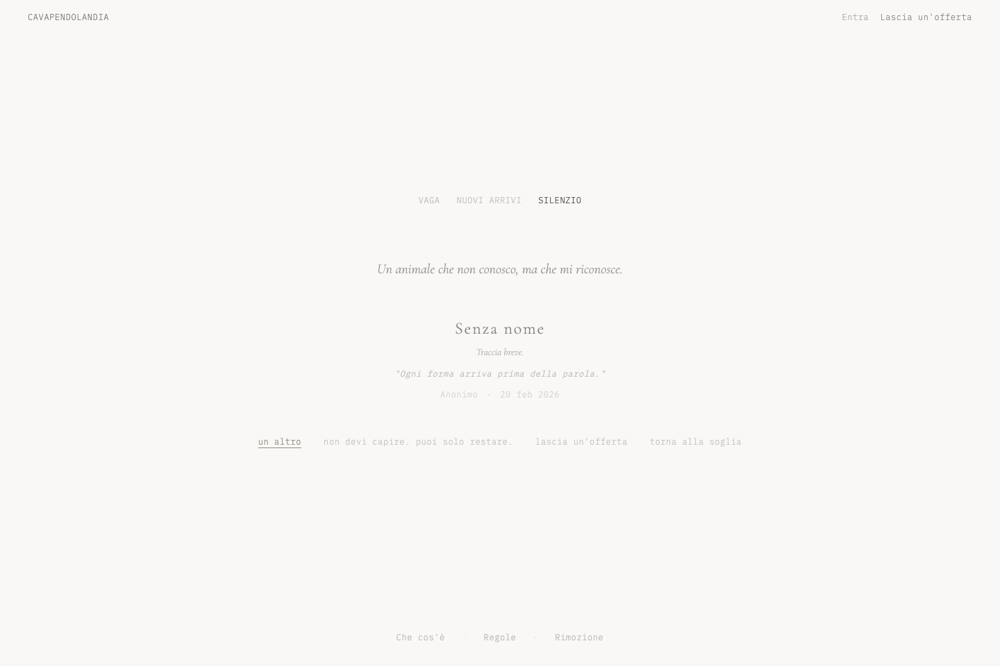
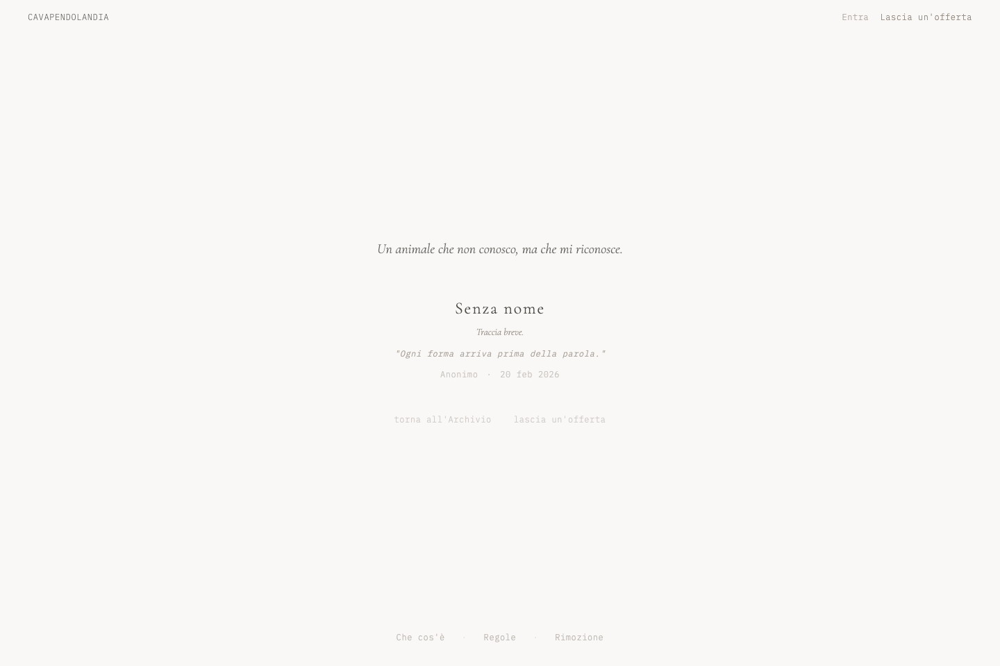
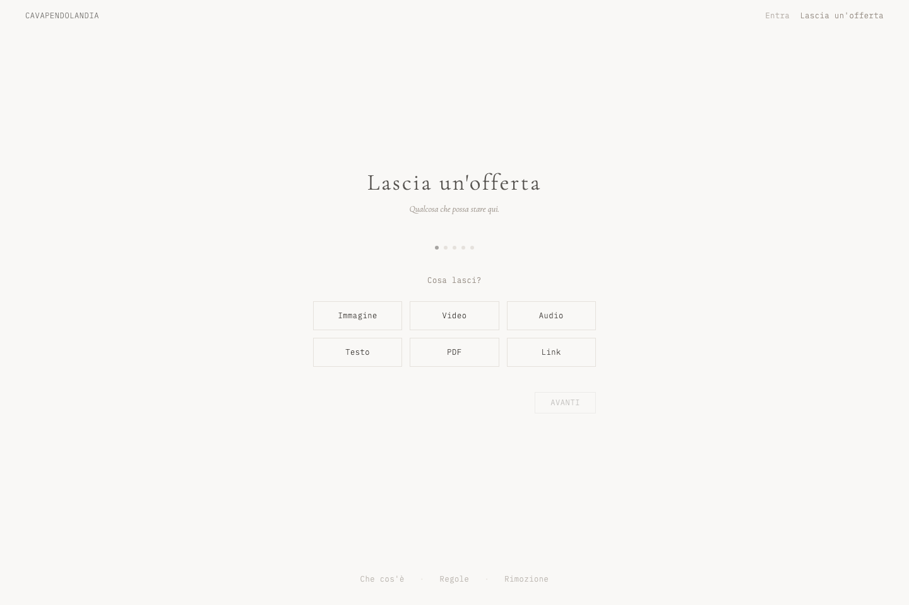
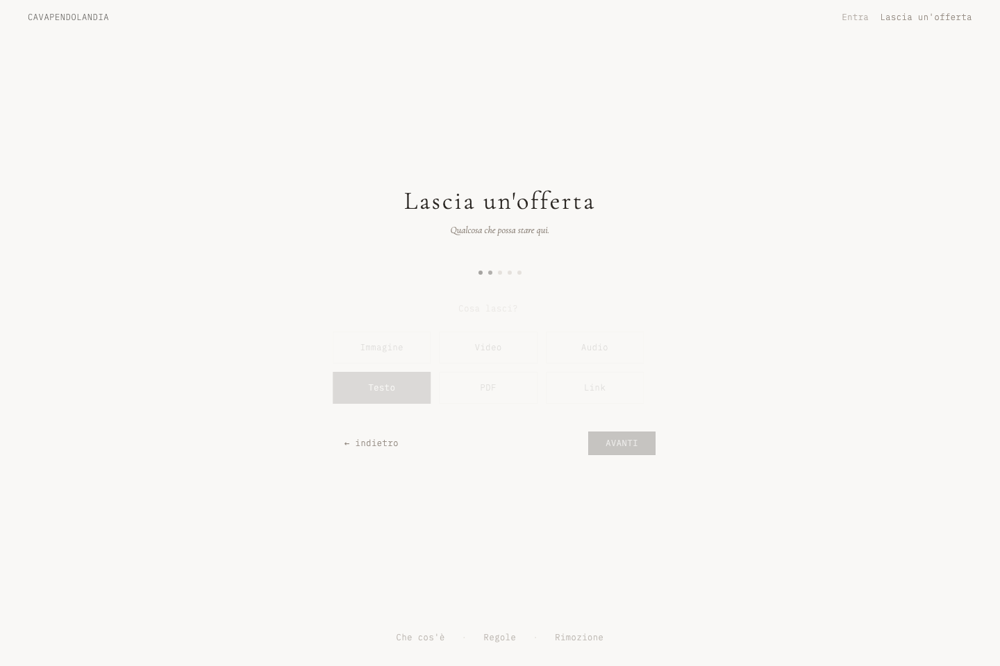
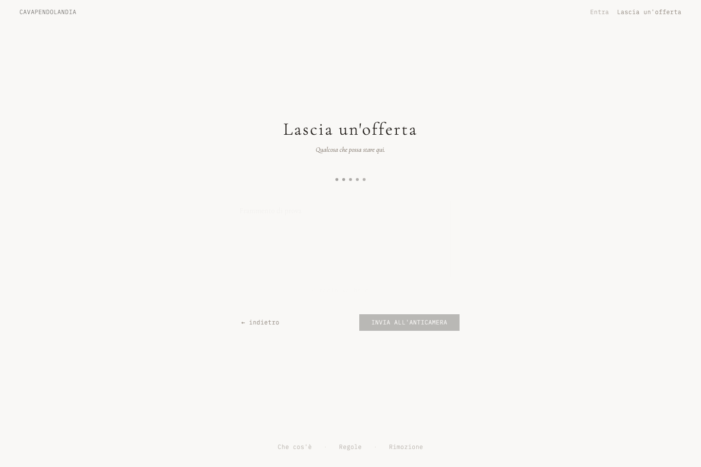
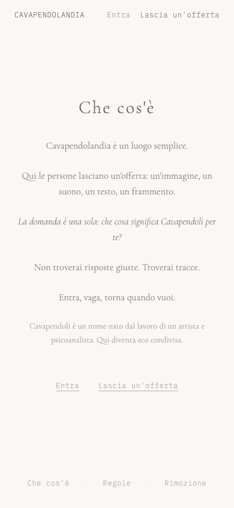
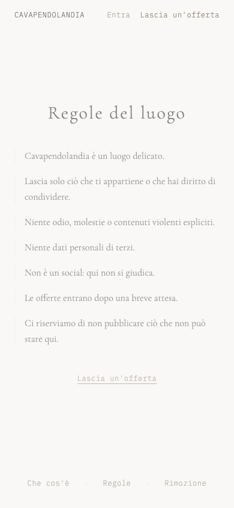
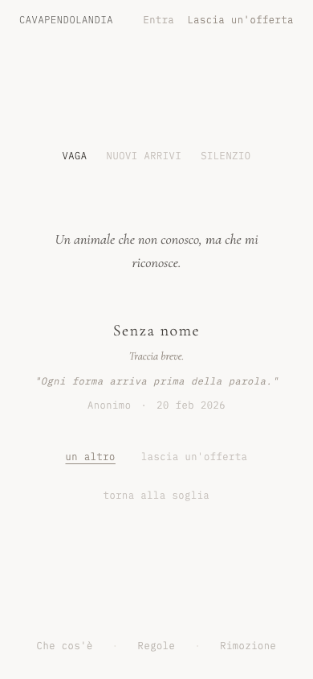

# UX Audit - Cavapendolandia (Prima del redesign)

Data audit: 2026-02-27  
Obiettivo: valutare chiarezza, ritmo e percezione di "luogo" prima dell'intervento UI/UX.

## 1) Soglia (desktop)

- Cosa comunica adesso: landing elegante e pulita, con domanda centrale.
- Cosa dovrebbe comunicare: ingresso in una stanza silenziosa, con senso di soglia e rito.
- Problema UX principale: CTA corrette ma ancora "landing-like", poco rituale.

## 2) Entra - Vaga (desktop)

- Cosa comunica adesso: archivio funzionale con modalità chiare.
- Cosa dovrebbe comunicare: deriva lenta, non consultazione di contenuti.
- Problema UX principale: manca un ritmo percepibile di "vagare" (indicatori e pacing).

## 3) Entra - Silenzio (desktop)

- Cosa comunica adesso: modalità alternativa con microcopy dedicata.
- Cosa dovrebbe comunicare: attenzione piena e sospensione, quasi contemplativa.
- Problema UX principale: differenza visiva con Vaga troppo lieve, silenzio non ancora "immersivo".

## 4) Offerta dettaglio (desktop)

- Cosa comunica adesso: card ben leggibile con metadati e azioni.
- Cosa dovrebbe comunicare: oggetto trovato, etichetta discreta, UI invisibile.
- Problema UX principale: impaginazione ancora da card UI, poco da "stanza museale".

## 5) Offri - Step 1 Scelta (desktop)

- Cosa comunica adesso: wizard ordinato e comprensibile.
- Cosa dovrebbe comunicare: gesto iniziale semplice e quasi cerimoniale.
- Problema UX principale: progress dots anonimi e tono da form multi-step.

## 6) Offri - Step 2 Deposito (desktop)

- Cosa comunica adesso: passo pratico, helper utili.
- Cosa dovrebbe comunicare: deposito morbido, senza burocrazia.
- Problema UX principale: microcopy non perfettamente coerente tra varianti media.

## 7) Offri - Step 5 Consenso (desktop)

- Cosa comunica adesso: consensi chiari e completi.
- Cosa dovrebbe comunicare: cura del luogo, non legalese.
- Problema UX principale: densità visiva un po tecnica nel passaggio finale.

## 8) Che cos'è (mobile)

- Cosa comunica adesso: manifesto breve e coerente.
- Cosa dovrebbe comunicare: invito poetico molto leggibile anche su schermo piccolo.
- Problema UX principale: blocco testo ancora troppo uniforme, poca gerarchia ritmica.

## 9) Regole (mobile)

- Cosa comunica adesso: regole gentili e comprensibili.
- Cosa dovrebbe comunicare: patto di luogo delicato, netto ma non punitivo.
- Problema UX principale: impatto visivo un po piatto, sembra pagina informativa standard.

## 10) Entra - Vaga (mobile)

- Cosa comunica adesso: esperienza utilizzabile su mobile.
- Cosa dovrebbe comunicare: deriva naturale con focus sul contenuto.
- Problema UX principale: header + footer comprimono la scena e riducono immersione.

## Sintesi priorita UX

1. Rafforzare la "Soglia" con gerarchia, spazio e ingresso lento.
2. Rendere Vaga/Silenzio due stati emotivi distinti, non solo due tab.
3. Alleggerire Offri in tono rituale (naming step, copy, ritmo).
4. Ridurre la percezione "app/card" nel dettaglio offerta.
5. Uniformare microtipografia e spaziatura su mobile/desktop.
